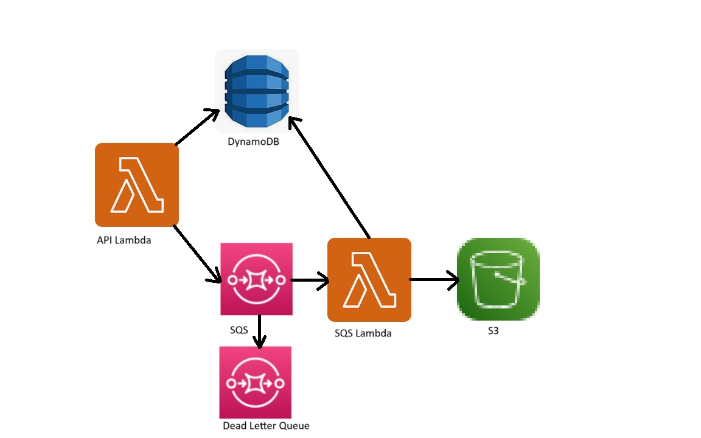

## Using the AWS CDK with Localstack

from terminal window

### create sample app
```bash
mkdir stack
cd stack
mkdir aws
cd aws
cdklocal init init app --language python
```

### bootstrap localstack environment
```bash
cdklocal synth
cdklocal bootstrap
```

# deploy the sample app
```bash
cdklocal deploy
> Do you wish to deploy these changes (y/n)? y
```

# destroy the structure
```bash
cdklocal destroy
```

All structure are build inside the folder with the python file:

""stack/aws/aws/aws_stack.py"

The lambda for structure should be inside the folder: 

"stack/aws/lambda"

## The Architecture of this stack


First API Lambda receive the JSON body with the payload:
```json
{ "id": "920183",
      "message": "Very Important Message",
      "image": { "file_name": "image.png",
                 "content": "usefull_image_content" } }
```
after it the API Lambda save to DynamoDB the record with "id" from the message
and then LAmda check the SQS queue and if the Attributes of the queue "ApproximateNumberOfMessages" less then 2 
then lambda send the message to the SQS

The second SQS Lambda triggered by the SQS and parse the message and after it the messages saved to the DynamoDB with the 
id, message, image file name and then saved the image to the S3 bucket
