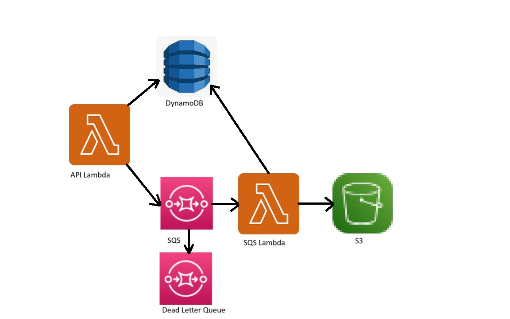

# create sample app
```batch
mkdir js_stack
cd js_stack
cdklocal init app --language=typescript
```
after cdklocal will create the poject go to the folder: "bin" and replace the "js_stack.ts" file with this repo file:
https://github.com/comsompom/AWS_cloud_use/blob/main/LocalStack/CDK_TS/js_stack-stack.ts

then inside this js_stack folder copy two lambdas with their folders: "api_lambda" and "sqs_lambda"

in the folder js_stack in the terminal run commands:
```batch
npm run build
cdklocal synth
cdklocal bootstrap
cdklocal deploy
> Do you wish to deploy these changes (y/n)? y
```

## The Architecture of this stack


First API Lambda receive the JSON body with the payload:
```json
{ "id": "920183",
      "message": "Very Important Message",
      "image": { "file_name": "image.png",
                 "content": "usefull_image_content" } }
```
after it the API Lambda save to DynamoDB the record with "id" from the message
and then LAmda check the SQS queue and if the Attributes of the queue "ApproximateNumberOfMessages" less then 2 
then lambda send the message to the SQS

The second SQS Lambda triggered by the SQS and parse the message and after it the messages saved to the DynamoDB with the 
id, message, image file name and then saved the image to the S3 bucket

